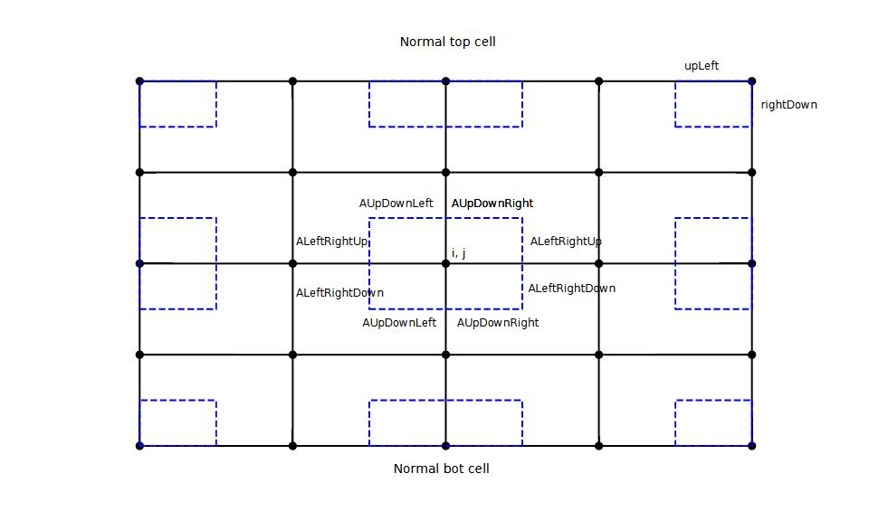

# MS calculator developper documentation

## Intro

Based on finite volume methode based on a structured rectangular grid, using a node centered approach

## Domain calculation

### Normal

Simple heat conduction eaquation using 8 fluxes (see picture)

### Side and corner cells

Conduction fluxes added when relevant (see picture)

### Air layers

In the case of "wall" calculation (mainly from left to right), it is possible to use air layers. 

The approach is the following:

## Boundary conditions

### Left and right boundary conditions

Convective boundary condition using h coefficient

### Top and down boundary conditions

Default: adiabatic (= no flux)

Alternative: fixed temperature. In practice, this is achieved using a convective BC with a very high (1e5) h value

