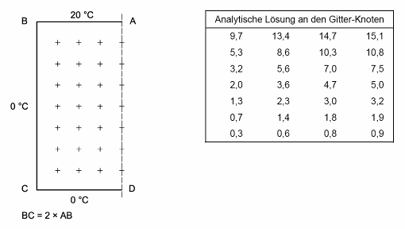

# MS calculator - validation

## Introduction

The code has been initially developped to solve the problem of thermal bridging of thin metallic structures in insulated walls. This has first been verified against another software (THERM) for various configurations of this specific use case. 

Then, in order to demonstrate its reliability, the code has been adapted to handle more boundary conditions and geometries (still for a rectangular domain), in order to demonstrate the compliance to NBN EN ISO 10211 for 2D calculations

## Validation against NBN EN ISO 10211 for 2D calculations

### Case 1

The reference geometry and analytical solutions from ISO 10211 are given in the figure below. 

Results of the test case with MS Calculator are given below. The numerical solution gives exactly the same results as the analytical reference. 

### Case 2

#### Reference results from ISO 10211

#### Results from MS Calculator

The total heat Flux computed with MS calculator is 9.53 W/m which is well in the +- 0.1 margin compared to the target heat flow rate of 9.5 W/m. 

The temperatures for all points are given in the figure below. They are all equal or within a 0.1°C margin compared to the reference case. 

## Comparison with THERM on several insulated walls

material exists, but still to write